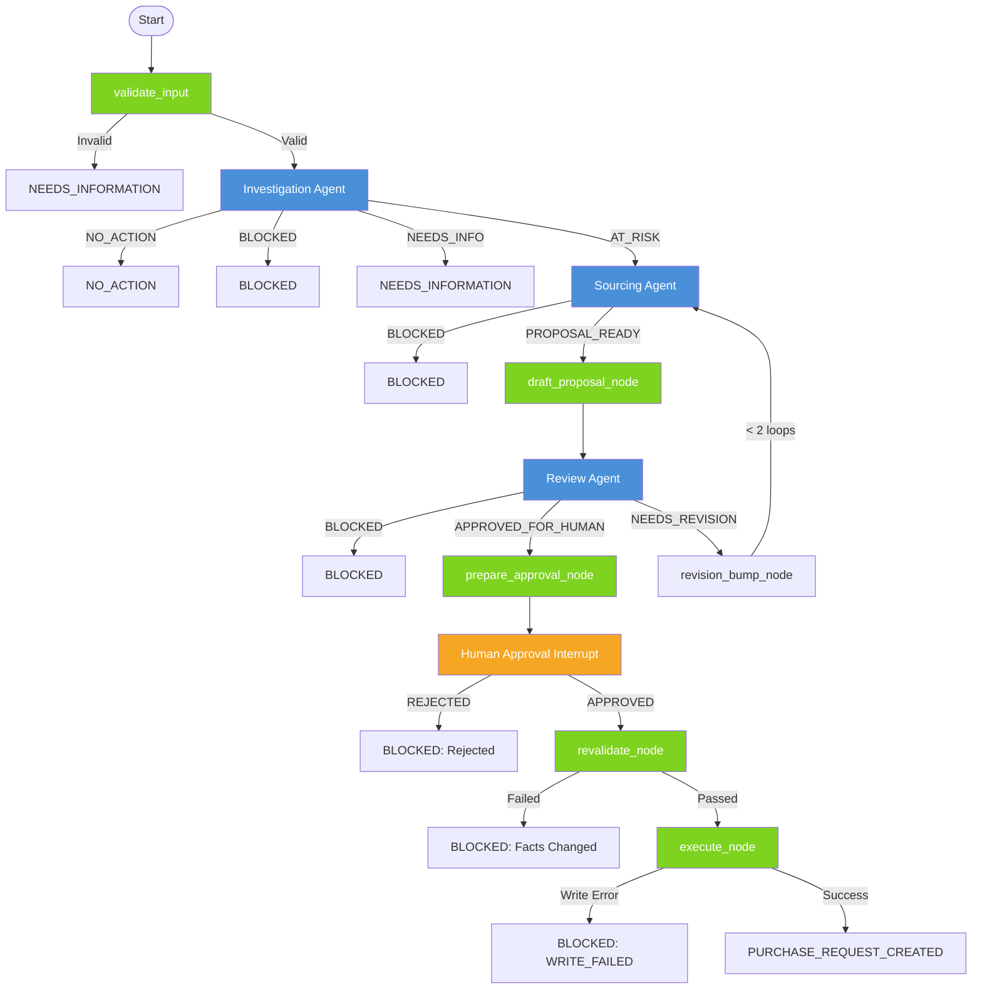

# Vitrious System Design

This document satisfies the design deliverables for the Vitrious Stockout Resolution System challenge.

## 1. Architecture Graph

*Blue nodes are LLM agents. Green nodes are deterministic functions. Orange is the human interrupt.*

## 2. Agent Charters

### Agent 1: Investigation Agent
- **Objective:** Investigate one SKU at one warehouse and determine if replenishment action is needed.
- **Input:** SKU, warehouse_id, target_cover_days
- **Tools:** `get_product`, `get_stock_position`, `get_sales_velocity`, `calculate_stock_risk`
- **Output Schema:** `InvestigationResult` (status, cover_days, at_risk, etc.)
- **Permissions:** Read-only access to inventory and sales data. No vendor or policy access.
- **Failure Behavior:** If data is missing or stale, returns `NEEDS_INFORMATION` or `BLOCKED` (DATA_STALE).

### Agent 2: Sourcing Agent
- **Objective:** Find and evaluate vendor options. Recommend a vendor with a clear cost-vs-speed trade-off explanation.
- **Input:** `InvestigationResult` context, target cover days, budget month
- **Tools:** `list_vendor_offers`, `get_vendor_performance`, `build_vendor_options`, `recommend_vendor_option`, `get_budget_position`
- **Output Schema:** `SourcingResult` (recommended_vendor, cost, is_over_budget, trade_off_explanation)
- **Permissions:** Read-only access to vendor and budget data. No policy or write access.
- **Failure Behavior:** If no eligible vendors or cost exceeds budget, returns `BLOCKED`. If data missing, `NEEDS_INFORMATION`.

### Agent 3: Review Agent
- **Objective:** Review the drafted proposal against `policy.md` guidance. Decide if it proceeds to human approval.
- **Input:** Full proposal, investigation evidence, sourcing evidence, policy text
- **Tools:** `get_policy_guidance`
- **Output Schema:** `ReviewResult` (policy_passed, timing_acceptable, budget_acceptable, specific violations)
- **Permissions:** Access to policy document only. No direct DB queries.
- **Failure Behavior:** If severe policy violations, returns `BLOCKED`. If fixable (e.g., choose faster vendor), returns `NEEDS_REVISION`.

## 3. Tool-Permission Matrix

| Tool | Investigation | Sourcing | Review | Deterministic Nodes |
|---|:---:|:---:|:---:|:---:|
| `get_product` | ✅ | ❌ | ❌ | ❌ |
| `get_stock_position` | ✅ | ❌ | ❌ | ✅ (Revalidate) |
| `get_sales_velocity` | ✅ | ❌ | ❌ | ❌ |
| `calculate_stock_risk` | ✅ | ❌ | ❌ | ❌ |
| `list_vendor_offers` | ❌ | ✅ | ❌ | ✅ (Revalidate) |
| `get_vendor_performance` | ❌ | ✅ | ❌ | ❌ |
| `build_vendor_options` | ❌ | ✅ | ❌ | ❌ |
| `recommend_vendor_option` | ❌ | ✅ | ❌ | ❌ |
| `get_budget_position` | ❌ | ✅ | ❌ | ✅ (Revalidate) |
| `get_policy_guidance` | ❌ | ❌ | ✅ | ❌ |
| `draft_replenishment_proposal`| ❌ | ❌ | ❌ | ✅ (Draft node) |
| `prepare_approval_request` | ❌ | ❌ | ❌ | ✅ (Approval node)|
| `create_purchase_request` | ❌ | ❌ | ❌ | ✅ (Execute node) |
| `append_audit_event` | ❌ | ❌ | ❌ | ✅ (All nodes) |

## 4. Shared State Design
See `submission/state/state.py`. The state uses `TypedDict` and is serializable (all models dumped to dicts) so LangGraph can persist it across the human interrupt. It categorizes state into: Input, Evidence, Proposal, Review, Approval, Execution, Workflow Control, and Audit.

## 5. Design Decisions

### Why not make everything agentic?
We deliberately chose to use **deterministic code** for drafting the proposal, revalidating data, and executing the database write. 
- **Writing to DB:** An LLM should never directly write to a database, as it can hallucinate fields or ignore idempotency rules.
- **Drafting the proposal:** The proposal structure is rigid. Assembling the parts into the `ReplenishmentProposal` Pydantic model is a mechanical data mapping task, not a reasoning task.
- **Revalidation:** Checking if stock age is < 48 hours is simple math. It doesn't require an LLM.

### Bounded Revision
If the Review Agent rejects a proposal but thinks it's fixable, it sets status to `NEEDS_REVISION`. The graph routes back to the Sourcing Agent. To prevent infinite loops, we increment `revision_count`. The graph enforces a maximum of 1 revision before forcing a terminal `BLOCKED` state.

### Revalidation Implementation
The provided codebase left `tools.execution.revalidate_approved_proposal` as a stub. Rather than mutating provided code, we implemented the revalidation logic inside `submission/nodes/revalidate.py`. It securely queries the database again after human approval to ensure facts (stock, budget, offers) haven't changed during the pause.
