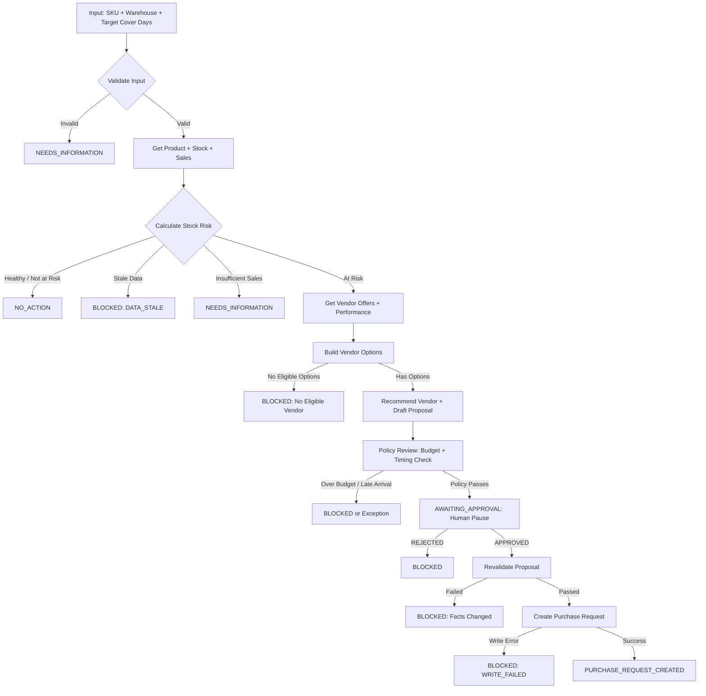

# Vitrious (Inventra) — Complete Codebase Analysis

> **Analyzed on**: September 5, 2026
> **Project path**: `d:\Learnings\IIT-M Agentic AI\Projects\Proquirement - Mini project\Vitrious`

---

## What This Project Is

This is a **multi-agent stockout resolution system** called **Inventra** — an IIT-M Agentic AI mini project. It provides all the **infrastructure** (database, tools, models, test scenarios) and asks students to build the **submission** (agents, state, LangGraph workflow, tests, docs) in a `submission/` folder.

**The goal**: An AI-powered system that detects warehouse SKU stockout risks, finds vendor replenishment options, builds a proposal, gets human approval, then executes a purchase request — all with auditability and safety guarantees.

---

## Architecture Overview

```
┌─────────────┐    ┌────────────┐    ┌──────────────┐    ┌───────────────┐
│  database/   │    │  domain/    │    │   tools/      │    │  fixtures/    │
│  schema.sql  │◄───│ tool_models │◄───│  inventory    │    │ scenarios.json│
│  seed.py     │    │  (Pydantic) │    │  sales        │    │ (12 tests)    │
│  inventra.db │    │             │    │  vendors      │    └───────────────┘
└─────────────┘    └────────────┘    │  policy       │
                                      │  execution    │
                                      │  workflow     │
                                      │  langchain_   │
                                      │    tools      │
                                      └──────────────┘
```

---

## File Structure

```
Vitrious/
├── .env.example                             ← Config template (OpenAI key, LangChain, DB path, feature flags)
├── README.md                                ← Full project brief (294 lines)
├── policy.md                                ← Review policy document loaded by agents
├── __init__.py                              ← Package root (v1.0.0, by Coding Ninjas)
├── requirements.txt                         ← pydantic>=2, langchain-core>=0.3, python-docx, jupyter
├── Inventra_Student_Design_Challenge.docx   ← Problem brief (Word doc)
├── Session 16 - ADK.excalidraw             ← Architecture diagram file
├── test_tools.ipynb                         ← Jupyter notebook for tool testing
│
├── database/                                ← PROVIDED
│   ├── __init__.py
│   ├── schema.sql                           ← 6 tables + indexes (152 lines)
│   ├── inventra.db                          ← Seeded SQLite (~180KB)
│   └── seed.py                              ← Creates test data (268 lines)
│
├── domain/                                  ← PROVIDED
│   ├── __init__.py
│   └── tool_models.py                       ← All Pydantic schemas (453 lines)
│
├── tools/                                   ← PROVIDED (read-only + write-only)
│   ├── __init__.py
│   ├── inventory.py                         ← get_product, get_stock_position, calculate_stock_risk
│   ├── sales.py                             ← get_sales_velocity
│   ├── vendors.py                           ← list_vendor_offers, get_vendor_performance, build_vendor_options
│   ├── policy.py                            ← get_budget_position, get_policy_guidance
│   ├── execution.py                         ← revalidate, create_purchase_request, append_audit_event
│   ├── workflow.py                          ← recommend_vendor_option, draft_proposal, prepare_approval, record_review
│   └── langchain_tools.py                   ← StructuredTool wrappers for LangChain agents
│
├── fixtures/                                ← PROVIDED
│   ├── __init__.py
│   └── scenarios.json                       ← 12 acceptance test scenarios
│
└── submission/                              ← TO BE CREATED BY STUDENT
    ├── README.md
    ├── design.md
    ├── app.py
    ├── state/
    └── ...
```

---

## Layer-by-Layer Breakdown

### 1. Database Layer

**File**: [schema.sql](file:///d:/Learnings/IIT-M Agentic AI/Projects/Proquirement - Mini project/Vitrious/database/schema.sql)
**File**: [seed.py](file:///d:/Learnings/IIT-M Agentic AI/Projects/Proquirement - Mini project/Vitrious/database/seed.py)

#### Tables (6 + 2 write targets)

| Table | Purpose | Key Fields |
|---|---|---|
| `products` | SKU master data | `sku` (PK), `name`, `category`, `active` |
| `inventory_snapshots` | Point-in-time stock readings | `snapshot_id`, `on_hand`, `reserved`, `confirmed_inbound`, `captured_at` |
| `sales_daily` | Daily sales per SKU/warehouse | `sale_date`, `sku`, `warehouse_id`, `units_sold` |
| `vendors` | Vendor profiles + performance metrics | `on_time_rate`, `fill_rate`, `quality_score` |
| `vendor_offers` | Active vendor offers per SKU | `unit_price`, `moq`, `lead_time_days`, `valid_until` |
| `monthly_budgets` | Warehouse budget tracking | `budget_amount`, `spent_amount`, `committed_amount` |
| `purchase_requests` | **Write target** — idempotent via `UNIQUE(idempotency_key)` | `status`, `approved_by` |
| `audit_events` | Full audit trail | `actor`, `event_type`, `payload_json` |

#### Seeded Test Data

- **8 products**: AC-001 through AC-006, REF-001, TV-001
- **5 vendors**: V-FAST (reliable), V-CHEAP (reliable), V-BALANCED (reliable), V-SLOW (unreliable), V-UNRELIABLE (unreliable)
- **6 inventory snapshots**: One per AC-* SKU at warehouse DEL-01
- **Sales history**: 30 days for most SKUs, only 14 days for AC-005
- **14 vendor offers**: Various combinations per SKU, including expired ones for AC-006
- **1 budget row**: DEL-01 for current month — $50K budget, $30K spent, $5K committed = **$15K remaining**

#### Key Seeded Data Details

| SKU | Stock (on_hand/reserved/inbound) | Available | Velocity | Snapshot Age | Notes |
|---|---|---|---|---|---|
| AC-001 | 50/10/0 | 40 | 3/day | ~30 min | Healthy stock (>13 days cover) |
| AC-002 | 40/8/0 | 32 | 3/day | ~3.25 days | **Stale** (>48hrs) |
| AC-003 | 20/5/0 | 15 | 2/day | ~45 min | Low stock, speed trade-off |
| AC-004 | 15/3/0 | 12 | 3/day | ~50 min | Over budget scenario |
| AC-005 | 100/10/0 | 90 | 2/day | ~20 min | New SKU, limited sales history |
| AC-006 | 12/2/0 | 10 | 2/day | ~40 min | Only unreliable/expired vendors |

#### Vendor Reliability

| Vendor | On-Time | Fill | Quality | Reliability (avg) | Eligible (≥0.90) |
|---|---|---|---|---|---|
| V-FAST | 0.95 | 0.98 | 0.96 | 0.963 | ✅ |
| V-CHEAP | 0.92 | 0.90 | 0.91 | 0.910 | ✅ |
| V-BALANCED | 0.93 | 0.94 | 0.93 | 0.933 | ✅ |
| V-SLOW | 0.80 | 0.85 | 0.82 | 0.823 | ❌ |
| V-UNRELIABLE | 0.70 | 0.75 | 0.72 | 0.723 | ❌ |

---

### 2. Domain Models

**File**: [tool_models.py](file:///d:/Learnings/IIT-M Agentic AI/Projects/Proquirement - Mini project/Vitrious/domain/tool_models.py) (453 lines)

#### Enums

- `ErrorCode` — 7 codes: `NOT_FOUND`, `INACTIVE`, `INSUFFICIENT_DATA`, `DATA_STALE`, `INVALID_INPUT`, `UNAUTHORIZED`, `WRITE_FAILED`, `UNKNOWN_ERROR`
- `ProposalStatus` — 5 statuses: `NO_ACTION`, `NEEDS_INFORMATION`, `BLOCKED`, `AWAITING_APPROVAL`, `PURCHASE_REQUEST_CREATED`
- `PurchaseRequestStatus` — 4 statuses: `PENDING`, `CONFIRMED`, `REJECTED`, `FAILED`

#### Read Output Models

| Model | Returned By | Key Fields |
|---|---|---|
| `ProductRecord` | `get_product()` | `sku`, `name`, `category`, `active`, `evidence_id`, `error` |
| `StockPosition` | `get_stock_position()` | `snapshot_id`, `on_hand`, `reserved`, `confirmed_inbound`, `captured_at`, `evidence_id` |
| `SalesVelocity` | `get_sales_velocity()` | `window_7_days`, `window_30_days`, `observation_count_7/30`, `evidence_id` |
| `StockRisk` | `calculate_stock_risk()` | `available_units`, `daily_velocity`, `cover_days`, `projected_stockout_date`, `at_risk`, `stale` |
| `VendorOffer` | (part of VendorOfferList) | `offer_id`, `vendor_id`, `unit_price`, `moq`, `lead_time_days`, `valid_until` |
| `VendorOfferList` | `list_vendor_offers()` | `offers[]`, `expired_count`, `inactive_count` |
| `VendorPerformance` | (part of VendorPerformanceList) | `on_time_rate`, `fill_rate`, `quality_score`, `reliability`, `eligible` |
| `VendorPerformanceList` | `get_vendor_performance()` | `vendors[]` |
| `VendorOption` | (part of VendorOptionList) | `quantity`, `total_cost`, `expected_arrival`, `meets_deadline`, `reliable`, `eligible`, `flag_cheapest`, `flag_fastest` |
| `VendorOptionList` | `build_vendor_options()` | `options[]`, `eligible_options[]`, `cheapest_option`, `fastest_option` |
| `BudgetPosition` | `get_budget_position()` | `budget_amount`, `spent_amount`, `committed_amount`, `remaining` |
| `PolicyGuidance` | `get_policy_guidance()` | `policy_version`, `policy_text`, `summary` |

#### Write Output Models

| Model | Returned By | Key Fields |
|---|---|---|
| `RevalidationResult` | `revalidate_approved_proposal()` | `hash_matches`, `stock_valid`, `offer_valid`, `budget_valid`, `all_checks_pass` |
| `PurchaseRequestResult` | `create_purchase_request()` | `request_id`, `status`, `created` (bool for idempotency), `error` |
| `AuditEventResult` | `append_audit_event()` | `event_id`, `created` |

#### Workflow / Proposal Models

| Model | Purpose |
|---|---|
| `ReplenishmentProposal` | Central artifact — includes all evidence IDs, facts, recommendation, cost/speed trade-off, policy check |
| `VendorRecommendation` | Chosen vendor option with plain-English rationale |
| `ApprovalRequest` | Pause payload for human review |
| `ApprovalDecision` | Human's resume input (APPROVED/REJECTED + hash integrity) |
| `HumanReviewResult` | Normalized review outcome with `next_status` |

#### Input Schemas (for StructuredTool args)

`ProductInput`, `StockPositionInput`, `StockRiskInput`, `SalesInput`, `VendorOffersInput`, `VendorPerformanceInput`, `BuildVendorOptionsInput`, `VendorRecommendationInput`, `BudgetPositionInput`, `PolicyGuidanceInput`, `RevalidationInput`, `PurchaseRequestInput`, `AuditEventInput`, `ProposalDraftInput`, `HumanReviewInput`, `ApprovalRequestInput`

> [!NOTE]
> Every read model carries `evidence_id` and `retrieved_at` (UTC) for full audit traceability. Forward references like `PurchaseRequestInput` referencing `ReplenishmentProposal` are resolved via `model_rebuild()` at the bottom of the file.

---

### 3. Tools Layer — Read-Only Tools

#### Inventory Tools — [inventory.py](file:///d:/Learnings/IIT-M Agentic AI/Projects/Proquirement - Mini project/Vitrious/tools/inventory.py)

| Function | Type | Logic |
|---|---|---|
| `get_product(sku)` | DB read | Returns `ProductRecord`; handles NOT_FOUND and INACTIVE |
| `get_stock_position(sku, warehouse_id)` | DB read | Latest snapshot by `captured_at DESC`; returns `StockPosition` |
| `calculate_stock_risk(available_units, daily_velocity, target_cover_days, snapshot_captured_at)` | **Pure deterministic** | No DB access. Calculates `cover_days = available / velocity`, `at_risk = cover_days < target AND NOT stale`, `stale = freshness > 48hrs`. Min velocity clamped to 0.1. Target must be 7-45 days. |

> [!IMPORTANT]
> `calculate_stock_risk` sets `at_risk = False` when data is stale — the stale flag itself blocks the case at a higher level, not via `at_risk`.

#### Sales Tools — [sales.py](file:///d:/Learnings/IIT-M Agentic AI/Projects/Proquirement - Mini project/Vitrious/tools/sales.py)

| Function | Type | Logic |
|---|---|---|
| `get_sales_velocity(sku, warehouse_id, windows=(7,30))` | DB read | Queries `sales_daily` for 7-day and 30-day windows. Returns `INSUFFICIENT_DATA` if either window has < 3 observations. Velocity = total_units / window_days. |

#### Vendor Tools — [vendors.py](file:///d:/Learnings/IIT-M Agentic AI/Projects/Proquirement - Mini project/Vitrious/tools/vendors.py)

| Function | Type | Logic |
|---|---|---|
| `list_vendor_offers(sku)` | DB read | Filters out expired (`valid_until < now`) and inactive vendor offers. Counts excluded. Sorted by `unit_price ASC`. |
| `get_vendor_performance(vendor_ids)` | DB read | Calculates `reliability = avg(on_time_rate, fill_rate, quality_score)`. `eligible = reliability >= 0.90`. |
| `build_vendor_options(stock_risk, vendor_offers, vendor_performance)` | **Pure deterministic** | No DB. Builds `VendorOption` for each offer: `quantity = max(MOQ, available*0.5)`, `total_cost = qty * price`, `expected_arrival = now + lead_time`, `meets_deadline = arrival <= stockout_date`, `eligible = meets_deadline AND reliable`. Flags cheapest/fastest. Sorted by cost. |

#### Policy Tools — [policy.py](file:///d:/Learnings/IIT-M Agentic AI/Projects/Proquirement - Mini project/Vitrious/tools/policy.py)

| Function | Type | Logic |
|---|---|---|
| `get_budget_position(warehouse_id, budget_month)` | DB read | `remaining = budget - spent - committed`. Returns NOT_FOUND if no budget row. |
| `get_policy_guidance(sku, warehouse_id, target_cover_days)` | File read | Reads `policy.md` from disk, returns full text as `PolicyGuidance` model. |

---

### 4. Tools Layer — Write-Only Tools

**File**: [execution.py](file:///d:/Learnings/IIT-M Agentic AI/Projects/Proquirement - Mini project/Vitrious/tools/execution.py)

| Function | Type | Logic |
|---|---|---|
| `revalidate_approved_proposal(proposal_id, proposal_hash)` | **STUB** | ⚠️ Always returns `all_checks_pass=True`. Marked `TODO` — needs real implementation that re-checks stock freshness, vendor offer validity, and budget sufficiency against current DB state. |
| `create_purchase_request(proposal, idempotency_key, approved_by)` | DB write | Checks for existing `idempotency_key` first (returns existing if found = idempotent). Otherwise inserts new row with status `PENDING`. Handles `IntegrityError` for race conditions. |
| `append_audit_event(case_id, trace_id, actor, event_type, payload)` | DB write | Inserts structured audit event with JSON payload. |

> [!WARNING]
> `revalidate_approved_proposal()` is a **stub** — it always passes. The student submission MUST implement real revalidation logic to satisfy scenario #7 (APPROVAL_DATA_CHANGE).

---

### 5. Workflow Helpers

**File**: [workflow.py](file:///d:/Learnings/IIT-M Agentic AI/Projects/Proquirement - Mini project/Vitrious/tools/workflow.py)

| Function | Logic |
|---|---|
| `recommend_vendor_option(case_id, sku, warehouse_id, vendor_options, strategy)` | Strategy selection: `cheapest` → min cost eligible, `fastest` → min lead_time eligible, `balanced` → cheapest eligible with trade-off explanation. Returns `BLOCKED` if no eligible options. |
| `draft_replenishment_proposal(input: ProposalDraftInput)` | Assembles `ReplenishmentProposal` from all evidence. Generates `proposal_hash` (SHA256 of case_id + sku + warehouse + vendor + qty + price + target_days). Sets `policy_passed=False` initially. |
| `prepare_approval_request(proposal)` | Simple wrapper → `ApprovalRequest(case_id, proposal, approval_required=True)` |
| `record_human_review(case_id, proposal, approver, decision, comments)` | Normalizes decision: APPROVED → `AWAITING_APPROVAL`, REJECTED → `BLOCKED`, anything else → `REVISE` / `NEEDS_INFORMATION`. |

---

### 6. LangChain Tool Wrappers

**File**: [langchain_tools.py](file:///d:/Learnings/IIT-M Agentic AI/Projects/Proquirement - Mini project/Vitrious/tools/langchain_tools.py)

- Thin wrapper functions that call the real tools and return `model.model_dump(mode="json")`
- `build_langchain_tools(include_write_tools=False)` → list of 14 `StructuredTool` instances (read-only by default)
- `build_tool_lookup()` → `Dict[str, StructuredTool]` for programmatic access
- Write tools (`create_purchase_request`, `append_audit_event`) only included when `include_write_tools=True`

---

### 7. Policy Document

**File**: [policy.md](file:///d:/Learnings/IIT-M Agentic AI/Projects/Proquirement - Mini project/Vitrious/policy.md)

Defines the review process agents must follow:

1. **8 Review Questions**: freshness (2-day threshold), is SKU at risk?, sales sufficiency, valid vendor options, cost/speed trade-off explanation, arrival vs stockout timing, budget fit, evidence grounding
2. **4 Status Labels**: `NO_ACTION`, `BLOCKED`, `AWAITING_APPROVAL`, `NEEDS_INFORMATION`
3. **Approval rules**: Explicit, tied to exact proposal version, supports APPROVED/REJECTED/REVISE
4. **Execution rules**: Revalidate before write, invalidate if facts changed, use idempotency

---

### 8. Test Fixtures

**File**: [scenarios.json](file:///d:/Learnings/IIT-M Agentic AI/Projects/Proquirement - Mini project/Vitrious/fixtures/scenarios.json)

#### 12 Acceptance Scenarios

| # | ID | SKU | Expected Outcome | Key Behavior |
|---|---|---|---|---|
| 1 | `HEALTHY_STOCK` | AC-001 | `NO_ACTION` | at_risk=false, vendor tools NOT called |
| 2 | `MISSING_DATA` | null | `NEEDS_INFORMATION` | Validate input before DB queries |
| 3 | `STALE_STOCK` | AC-002 | `BLOCKED` (DATA_STALE) | stale=true blocks the case |
| 4 | `COST_VS_SPEED` | AC-003 | `AWAITING_APPROVAL` | Proposal explains trade-off with evidence |
| 5 | `OVER_BUDGET` | AC-004 | `BLOCKED` or exception | Budget remaining ($15K) < cheapest option cost |
| 6 | `INVALID_OUTPUT` | AC-001 | `BLOCKED` | Pydantic validation fail → 1 retry → fail closed |
| 7 | `APPROVAL_DATA_CHANGE` | AC-001 | `BLOCKED` | Revalidation detects changed facts |
| 8 | `DUPLICATE_APPROVAL` | AC-001 | `PURCHASE_REQUEST_CREATED` | Idempotency key prevents duplicate writes |
| 9 | `HUMAN_REJECTION` | AC-001 | `BLOCKED` | Approver rejects, audit logged |
| 10 | `WRITE_FAILURE` | AC-001 | `BLOCKED` (WRITE_FAILED) | DB error caught, no partial data |
| 11 | `INSUFFICIENT_SALES_HISTORY` | AC-005 | `NEEDS_INFORMATION` | < 3 observations → INSUFFICIENT_DATA |
| 12 | `UNRELIABLE_VENDOR` | AC-006 | `BLOCKED` | No eligible vendors (all unreliable or expired) |

---

## Critical Design Constraints

> [!IMPORTANT]
> These constraints are non-negotiable and define the safety boundaries of the system.

### 1. No Generic SQL
- ✅ Use provided read tools
- ❌ No `SELECT *` or arbitrary SQL to LLM agents
- ❌ No direct database connection credentials

### 2. Calculation Authority
- ✅ Use `calculate_stock_risk()` for stock math
- ✅ Use `build_vendor_options()` for option comparison
- ❌ Agents cannot invent stock levels, prices, or reliability scores

### 3. Write Safety
- ✅ Only deterministic (non-LLM) nodes call write tools
- ✅ Only after explicit human approval
- ✅ Only after successful revalidation
- ❌ Never from within an LLM agent
- ❌ Never before human approval pause

### 4. Approval is an Interrupt
- ✅ Pause execution with durable case ID and thread state
- ✅ Wait for explicit human decision (APPROVED / REJECTED)
- ❌ Never infer approval from chat text
- ❌ Never auto-approve

### 5. Idempotent Writes
- ✅ Use idempotency key to prevent duplicates
- ✅ Database UNIQUE constraint on `idempotency_key`
- ✅ Same approval resumed twice creates one purchase request

---

## Known Gaps / TODOs in Provided Code

> [!WARNING]
> These are areas where the provided code is intentionally incomplete.

1. **`revalidate_approved_proposal()`** is a stub — always returns `all_checks_pass=True`. Must be properly implemented to support scenarios #7 (approval data change) and #10 (write failure).

2. **No `submission/` folder exists** — the student must create:
   - 2–4 specialized agents with clear objectives
   - Persistent shared state across approval pauses
   - LangGraph workflow with branching, pause/resume, safe writes
   - Tests for all 12 scenarios + 3 failure paths
   - Architecture documentation

3. **`build_vendor_options()` quantity logic** uses `max(MOQ, available_units * 0.5)` which may not always make business sense — students may want to improve this.

4. **Budget**: Only $15K remaining ($50K - $30K spent - $5K committed). AC-004 offers are $500/unit × 3 MOQ = $1,500 minimum, which fits budget. The "over budget" scenario works because the total cost at realistic quantities likely exceeds $15K.

---

## Intended Workflow (Student Must Implement)



---

## Dependencies

From [requirements.txt](file:///d:/Learnings/IIT-M Agentic AI/Projects/Proquirement - Mini project/Vitrious/requirements.txt):

```
pydantic>=2.0,<3.0
langchain-core>=0.3,<0.4
python-docx>=1.1,<2.0
jupyter>=1.0,<2.0
```

Student submission will likely also need: `langgraph`, `langchain-openai` (or similar LLM provider).

---

## Environment Configuration

From [.env.example](file:///d:/Learnings/IIT-M Agentic AI/Projects/Proquirement - Mini project/Vitrious/.env.example):

| Variable | Default | Notes |
|---|---|---|
| `OPENAI_API_KEY` | — | Required |
| `MODEL_NAME` | gpt-4 | LLM model |
| `DATABASE_PATH` | database/inventra.db | SQLite path |
| `DATA_FRESHNESS_THRESHOLD` | 2 | Hours (but code uses 48hrs/2 days) |
| `DEFAULT_MONTHLY_BUDGET` | 50000 | USD |
| `DEFAULT_TARGET_COVER_DAYS` | 14 | Days |
| `ENABLE_AUTO_APPROVAL` | false | Must stay false |
| `MAX_AGENT_RETRIES` | 2 | For invalid output recovery |
